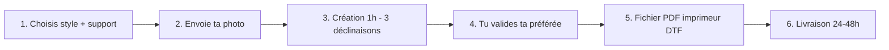
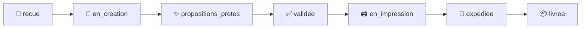
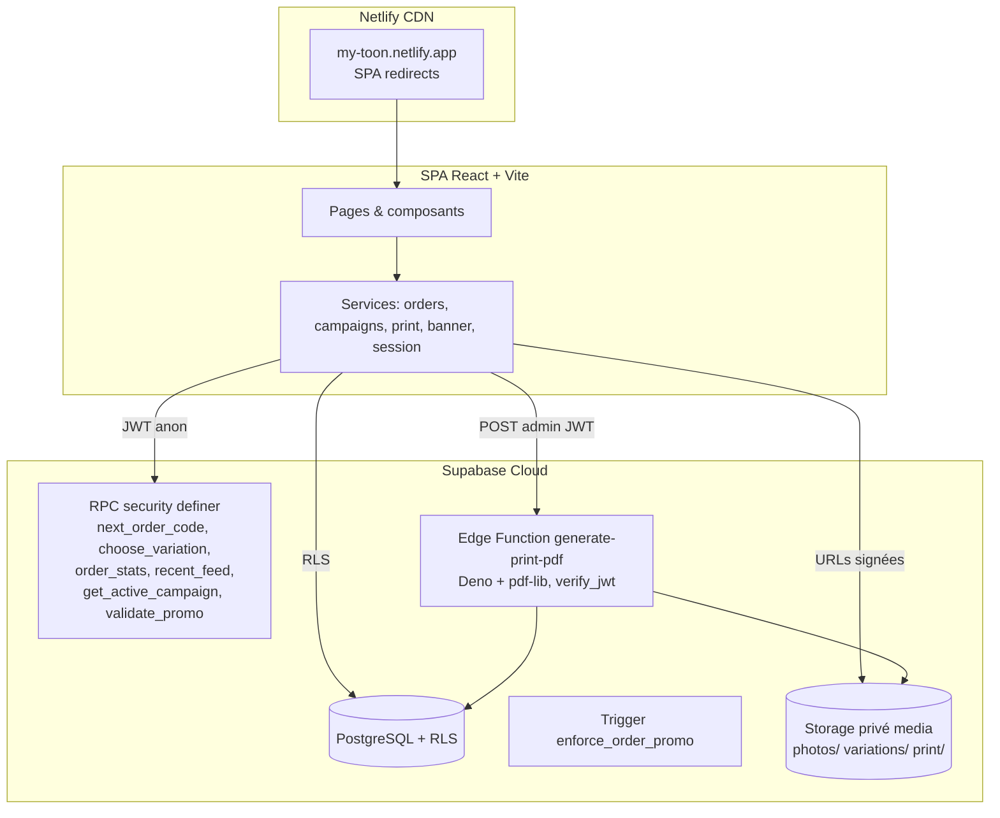

# MyToon 🦸

> **Envoie une photo, reçois un héros à porter.**

**MyToon** est une boutique streetwear nouvelle génération née à Abidjan. Tu envoies une photo, nos artistes te créent **3 déclinaisons toon** en **1 heure chrono**, et tu reçois un t-shirt ou un polo 100 % coton local imprimé avec ton héros — **livré en 24-48 h** à Abidjan.

[🚀 Démo en ligne](https://my-toon.netlify.app/) · [📦 Repository](https://github.com/sieni7/MyToon) · [❓ Centre d'aide](docs/CENTRE-AIDE.md)


---

## ✨ Aperçu

### Le problème

Se faire personnaliser un vêtement à son effigie, c'est long, opaque et réservé à une poignée d'artisans. Le client ne voit jamais rien, ne choisit rien, et attend des semaines sans savoir où en est sa commande.

### La solution

MyToon inverse tout ça :

- **1 heure** pour recevoir **3 propositions** de ton toon — choisies par toi.
- Un vrai **artiste**, pas un filtre : chaque déclinaison est dessinée à la main à partir de ta photo.
- Un **suivi en temps réel** avec un simple code `MT-XXXX`.
- Un **fichier d'impression professionnel** (PDF A4 / DTF) transmis à l'imprimeur.
- Un **t-shirt ou polo coton local**, livré en **24-48 h** à Abidjan, **payé à la livraison**.

### Pourquoi ce projet existe

_Né à Abidjan, taillé pour les héros._ MyToon est une marque pensée pour l'Afrique et ouverte au monde : la personnalisation d'exception, démocratisée. Chaque personne mérite son propre héros.

---

## 🔑 Fonctionnalités principales

### Parcours utilisateur en 6 étapes
1. 👕 **Choisis** ton style (Manga, Comics, Pop Art) et ton support
2. 📷 **Envoie ta photo** + tes infos de livraison
3. 🎨 **Création (1 h)** — l'artiste crée 3 déclinaisons
4. ✅ **Tu valides** — tu choisis ta préférée
5. 📄 **Fichier d'impression** — PDF A4 DTF transmis à l'imprimeur
6. 🚚 **Livraison (24-48 h)** avec suivi `MT-XXXX`

### Workflow en 7 statuts
`recue` → `en_creation` → `propositions_pretes` → `validee` → `en_impression` → `expediee` → `livree`

### Et aussi
- **Validation client** : impossible d'imprimer avant que tu aies choisi ta déclinaison.
- **PDF A4 imprimeur (DTF)** : généré côté serveur (Edge Function Deno), téléchargeable, lien signé 7 jours, envoi WhatsApp.
- **Espace client** : historique, détail, pagination, **ré-commande** avec la même photo.
- **Atelier admin** : 4 files de travail, dépôt des déclinaisons, assignation imprimeur, timeline complète.
- **Campagnes saisonnières + codes promo** : bandeau thématique, couleur d'accent, remise **forcée côté serveur** (trigger SQL — infalsifiable côté client).
- **Preuve sociale vivante** : ticker « En direct » (anonymisé) + compteur réel de héros créés.
- **Paiement à la livraison** : Wave, Orange Money, MTN MoMo, espèces.
- **Pages légales** : CGV, Confidentialité, Livraison & retours.
- **Performance** : code-splitting par route, images à la demande, pagination.

---

## 🚀 Démo

| Ressource | Lien |
| --- | --- |
| 🌐 Démo en ligne | https://my-toon.netlify.app/ |
| 📦 Repository | https://github.com/sieni7/MyToon |
| ❓ Centre d'aide utilisateur | [`docs/CENTRE-AIDE.md`](docs/CENTRE-AIDE.md) |

---

## 🖼️ Captures d'écran

> **À compléter** — place tes captures dans `docs/screenshots/` et référence-les ici.

| | | |
| --- | --- | --- |
| **Accueil** — hero + parcours 6 étapes | **Commande** — choix style / support / photo | **Suivi** — timeline 7 statuts |
| `docs/screenshots/home.png` | `docs/screenshots/order.png` | `docs/screenshots/tracking.png` |
| **Atelier admin** — 4 files de travail | **PDF imprimeur (DTF)** | **Espace client** — commandes |
| `docs/screenshots/admin.png` | `docs/screenshots/print-pdf.png` | `docs/screenshots/client-space.png` |

---

## 🧭 Parcours utilisateur



**Les 7 statuts de la commande** (visibles en temps réel par le client) :



---

## 🛠️ Stack technique

| Couche | Technologie | Usage |
| --- | --- | --- |
| **Framework** | React 19 | UI, hooks, `React.lazy` + `Suspense` |
| **Build** | Vite 8 | Dev server, bundling, `import.meta.glob` |
| **Routing** | react-router-dom 7 | SPA multi-pages |
| **Backend / BDD** | Supabase (PostgreSQL 15) | Tables, RLS, RPC, Auth |
| **Auth** | Supabase Auth | Sessions anonymes clients + admin email/mdp |
| **Storage** | Supabase Storage (bucket privé `media`) | Photos, déclinaisons, PDF (URLs signées) |
| **Edge Function** | Deno + pdf-lib | Génération PDF A4 imprimeur |
| **Style** | CSS custom (variables) | `globals.css` + `responsive.css` |
| **Typographie** | Google Fonts | Poppins (texte) + Space Grotesk (titres) |
| **Lint** | oxlint | `.oxlintrc.json` |
| **Tests E2E** | Playwright | 6 suites (voir § Tests) |
| **Hébergement** | Netlify | Deploy automatique sur push `master` |
| **CLI BDD** | Supabase CLI | Migrations versionnées + deploy Edge |

> ℹ️ **Note sur l'IA** : MyToon n'utilise pas de transformation automatique par IA. Chaque toon est **dessiné à la main par un artiste** à partir de ta photo — c'est la différence qualitative du produit.

---

## 🏗️ Architecture



**Principes clés**
- **RLS stricte** : un client ne voit que ses commandes (`owner_user_id`), l'admin voit tout via `is_admin()` (fonction `security definer`).
- **Promo infalsifiable** : le trigger `enforce_order_promo` revalide chaque code contre `campaigns` (actif + dates) et force la remise côté serveur.
- **Aucun secret côté client** : seules des clés *publishable* sont embarquées ; les opérations sensibles passent par RPC ou Edge Function.

---

## 📁 Structure du projet

```
mytoon/
├── src/
│   ├── components/
│   │   ├── common/          # SignedImage, AvatarImage, StyleLightbox, ErrorBoundary
│   │   ├── cta/             # Section appel à l'action finale
│   │   ├── features/        # Features (valeurs), Phases (6 étapes), Testimonials, FAQ
│   │   ├── gallery/         # Galerie des styles + lightbox
│   │   ├── header/          # Header public + menu admin "Atelier"
│   │   ├── hero/            # SplashScreen, Hero, TeeMockup (SVG), Particles
│   │   ├── home/            # BeforeAfter, LiveTicker, Products, WorksGallery
│   │   ├── layout/          # Layout, Header, Footer, PromoBanner, SectionDivider
│   │   ├── order/           # OrderView (timeline + choix déclinaison)
│   │   └── upload/          # UploadArea (drag & drop + préview)
│   ├── context/             # CampaignProvider + useCampaign
│   ├── hooks/               # useImageUpload
│   ├── lib/                 # Client Supabase (supabase.js)
│   ├── pages/               # Home, Order, Tracking, Admin, Espace, MesCommandes, CommandeDetail, Legal
│   ├── services/            # orders, campaigns, banner, print, session
│   ├── styles/              # globals.css (design tokens) + responsive.css
│   └── utils/               # constants (styles, produits, statuts, journey), image, phone
├── supabase/
│   ├── config.toml          # verify_jwt = true (Edge Function)
│   ├── functions/
│   │   ├── _shared/cors.ts  # En-têtes CORS des Edge Functions
│   │   └── generate-print-pdf/index.ts  # PDF A4 DTF (Deno + pdf-lib)
│   └── migrations/          # 0001_init → 0009_remediation (versionné)
├── scripts/
│   └── seed-admin.mjs       # Création du compte admin
├── public/                  # favicon, _redirects, avatars, reference, prompts
├── *.mjs                    # Suites de tests Playwright / backend
└── vite.config.js
```

---

## 🚀 Installation

### Prérequis
- Node.js ≥ 20
- npm ≥ 10
- Un projet [Supabase](https://supabase.com) (gratuit)
- (Optionnel) CLI Supabase : `npx supabase`

### 1. Clone
```bash
git clone https://github.com/sieni7/MyToon.git
cd MyToon
```

### 2. Install
```bash
npm install
```

### 3. Configuration
Crée un fichier `.env.local` à la racine (jamais commité) :

```env
VITE_SUPABASE_URL=https://<project>.supabase.co
VITE_SUPABASE_PUBLISHABLE_KEY=<publishable_key>
```

> ℹ️ Le client Supabase est **désactivé proprement** si les variables sont absentes : le site reste navigable.

### 4. Développement
```bash
npm run dev       # http://localhost:5173
```

### 5. Build
```bash
npm run build     # sortie dans dist/
npm run preview   # prévisualisation du build
```

### 6. Déployer (Netlify)
Pousse sur `master` → déploiement automatique. Voir § Déploiement.

---

## 🔐 Variables d'environnement

### Côté front (build)
| Variable | Description | Exemple |
| --- | --- | --- |
| `VITE_SUPABASE_URL` | URL du projet Supabase | `https://<project>.supabase.co` |
| `VITE_SUPABASE_PUBLISHABLE_KEY` | Clé publique (anon/publishable) | `sb_publishable_...` |

### Côté scripts de test / admin (ne jamais commiter)
| Variable | Description |
| --- | --- |
| `SUPABASE_URL` | URL du projet Supabase |
| `SUPABASE_SECRET_KEY` | Clé service (secret) |
| `SUPABASE_PUBLISHABLE_KEY` | Clé publishable |
| `ADMIN_EMAIL` / `ADMIN_PASSWORD` | Compte admin pour les tests E2E |

> ⚠️ **Hygiène des secrets** : `.env` et `.env.*` sont dans `.gitignore`. Ne **jamais** y ajouter de secret de service, et déclarer les variables `VITE_*` dans le dashboard **Netlify** (Build & deploy → Environment).

---

## 💡 Usage

### Côté client
1. `/` — choisis un style ou clique sur « Activer mon pouvoir ».
2. `/commande` — 3 étapes : **avatar** → **support** (t-shirt/polo, taille, couleur) → **photo + infos** + récapitulatif (avec code promo éventuel).
3. Confirme → reçois ton code `MT-XXXX`.
4. `/suivi` — saisis ton code pour suivre les 7 statuts et choisir ta déclinaison quand les 3 propositions sont prêtes.
5. `/espace/commandes` — historique, détail, ré-commande.

### Côté admin (`/admin`)
1. Connecte-toi avec le compte admin (voir `scripts/seed-admin.mjs`).
2. **Commandes** : 4 files (`À traiter`, `En création`, `En validation client`, `À produire / Livraison`).
3. Dépose les **3 déclinaisons** (statuts `recue`/`en_creation`).
4. Quand le client valide : assigne un **imprimeur**, passe en impression → expédition → livrée.
5. **Fichier d'impression** : Générer le PDF A4 → 📄 Télécharger / 🔗 Copier le lien / 💬 Envoyer à l'imprimeur.
6. **Réglages** : bandeau promo. **Campagnes** : création, activation, code promo, couleur d'accent.

---

## ⚙️ Fonctionnement interne

### Base de données (migrations versionnées)

```bash
npx supabase db push
```

| Migration | Contenu |
| --- | --- |
| `0001_init.sql` | Tables `orders`, `admins`, `settings`, RLS, Storage `media`, RPC `choose_variation` |
| `0002_order_code_rpc.sql` | Table `counters` + RPC `next_order_code()` (`MT-0001`…) |
| `0003_fix_admin_policy.sql` | Fonction `is_admin()` (corrige la récursion RLS) |
| `0004_public_stats.sql` | RPC `order_stats()` (compteur héros public) |
| `0005_recent_feed.sql` | RPC `recent_feed()` (ticker anonymisé) |
| `0006_campaigns.sql` | Table `campaigns` + `get_active_campaign()` + `validate_promo()` + seed |
| `0007_orders_promo.sql` | Colonne `orders.promo` |
| `0008_print_pdf.sql` | Colonne `orders.print_pdf_path` |
| `0009_remediation.sql` | 7 statuts, backfill `owner_phone` E.164, trigger `enforce_order_promo` |

### RPC publiques (security definer, anonymisées)
- `next_order_code()` → codes `MT-XXXX`
- `choose_variation(code, index)` → validation de déclinaison (statut `propositions_pretes` uniquement)
- `order_stats()` → compteur public
- `recent_feed(n)` → ticker (prénom + quartier + style + statut)
- `get_active_campaign()` → campagne active (automatique par date)
- `validate_promo(code)` → remise d'un code actif

### Sécurité
- **RLS** : chaque client ne voit que ses commandes ; l'admin voit tout.
- **Trigger `enforce_order_promo`** : revalide promo + force la remise côté serveur.
- **Téléphone E.164** : `utils/phone.js` (10 chiffres → `+225…`, 13 chiffres `225…` conservés).
- **Edge Function `verify_jwt = true`** + contrôle admin interne (403 sinon).
- **Storage privé** : seules des URLs signées sont servies au navigateur.

### Workflow imprimeur (PDF A4 / DTF)
Quand une commande est `validee`, l'admin génère un PDF A4 via l'Edge Function `generate-print-pdf` (bandeau méta : code, client, téléphone, produit, taille, couleur, imprimeur, date + mention DTF + artwork), stocké dans `media/print/{code}.pdf`, téléchargeable / lien signé 7 jours / envoi WhatsApp.

---

## 🎨 Design System

### Couleurs
| Token | Valeur | Usage |
| --- | --- | --- |
| `--black` / `--black-2/3/4` | `#0a0a0a` → `#222222` | Fonds (thème sombre) |
| `--orange` | `#ff6b35` | Accent principal, CTA, badges |
| `--yellow` | `#fbbf24` | Secondaire, étapes, succès |
| `--gold` / `--gold-light` | `#d4af37` / `#f0d98c` | Premium, bordures, halos |
| `--purple` / `--pink` / `--cyan` | `#7c3aed` / `#ec4899` / `#06b6d4` | Couleurs des styles (Sketch/Cartoon/Pop Art) |
| `--gray-400/500/600` | `#a3a3a3` → `#525252` | Textes secondaires |

### Typographie
- **Poppins** (400→900) : texte et interfaces.
- **Space Grotesk** (400→700) : titres, logo, prix, numéros.

### Style & composants
- **Glassmorphism** : `.glass`, `.glass-strong` (blur + transparence).
- **Cartes dorées** : `.card-gold` (bordure fine + halo, hover lift).
- **Boutons** : `.btn-primary` (dégradé orange), `.btn-secondary`, `.btn-portal` (animé).
- **Texte dégradé** : `.gradient-text` (orange → jaune), `.gold-text`.

### Animations (CSS keyframes)
`float` (mockup t-shirt), `pulse-portal`, `border-rotate`, `reveal`, `pop` (succès), `slide-up`, `twinkle`, `shimmer`, `count-up`, `pulse` (ticker), `ticker-in`, `spin`, `lightning-flash`.

---

## ⚡ Performance

| Optimisation | Détail |
| --- | --- |
| **Code-splitting** | `React.lazy` + `Suspense` sur 7 routes (index ≈ **485 kB** avant → réduit) |
| **Images à la demande** | `WorksGallery` via `import.meta.glob` différé + `loading="lazy"` |
| **Pagination** | Espace client : 50 commandes/page + « Charger plus » |
| **Compression image** | `compressImageToBlob` (max 1200 px, qualité 0.82) à l'upload |
| **Splash unique** | `SplashScreen` une fois par session (`sessionStorage`) |
| **No-SW** | Les service workers obsolètes sont désinscrits au démarrage |

---

## ♿ Accessibilité

- Tick du live : `aria-live="polite"` (`LiveTicker`).
- Boutons icônes : `aria-label` (hamburger, navigation styles).
- Images : `alt` sur photos, avatars et déclinaisons.
- Structure sémantique : `header`, `main`, `section`, `footer`, `nav`.
- **ErrorBoundary** global : écran de secours au lieu d'une page blanche.
- FAQ : `aria-expanded` sur les accordéons.

> **À compléter** : audit complet (contrastes, navigation clavier, focus) à réaliser.

---

## 🌐 Support navigateur

| Navigateur | Statut |
| --- | --- |
| Chrome / Edge (dernières versions) | ✅ |
| Firefox (dernières versions) | ✅ |
| Safari / iOS (dernières versions) | ✅ |
| Android (WebView / Chrome) | ✅ |

> **À compléter** : matrice précise par version (aucune donnée officielle dans le dépôt).

---

## 🗺️ Roadmap

### Version actuelle
- [x] Parcours commande 6 étapes
- [x] Workflow 7 statuts + suivi `MT-XXXX`
- [x] 3 styles actifs (Manga, Comics, Pop Art)
- [x] Atelier admin (4 files, déclinaisons, imprimeur, timeline)
- [x] PDF A4 imprimeur (DTF)
- [x] Campagnes saisonnières + codes promo (serveur)
- [x] Espace client + ré-commande
- [x] Pages légales
- [x] Remédiation sécurité (RLS, trigger, E.164, verify_jwt)

### Prévu
- [ ] Styles **Cartoon** et **Sketch** (badge « Bientôt » déjà en place)
- [ ] Connexion par SMS (numéro + code) pour retrouver ses commandes sur n'importe quel appareil (Phase B)
- [ ] **À compléter** : suite de la feuille de route

---

## 🤝 Contributing

MyToon est un projet ouvert aux contributions. Merci de respecter ce workflow :

1. **Fork** le dépôt, crée une branche : `git checkout -b feat/ma-amelioration`.
2. Fais des commits **atomiques** et **descriptifs** (voir style ci-dessous).
3. Pousse et ouvre une **Pull Request** vers `master`.
4. Décris clairement : le problème, la solution, et les tests.

> **À compléter** : ajouter un `CONTRIBUTING.md` et des templates d'issues / PR si le projet s'ouvre à davantage de contributeurs.

### Convention de commits
| Type | Exemple |
| --- | --- |
| `feat` | `feat(campagnes): backend campaigns + codes promo` |
| `fix` | `fix(home): espacement des séparateurs` |
| `docs` | `docs: README pro (features, stack, setup)` |
| `refactor` | `refactor(splash): sobre (logo + tagline)` |
| `chore` | `chore: suppression fichiers obsolètes` |

---

## 🧹 Code Style

- **Lint** : `npm run lint` → oxlint (`plugins: react, oxc`, règles hooks).
- **Format** : Prettier recommandé (non imposé dans le dépôt) — **À compléter**.
- **Conventions** :
  - Composants React fonctionnels + hooks (`useState`, `useEffect`).
  - Styles inline ou via classes globales CSS (`globals.css`).
  - Services isolés dans `src/services/` (pas de logique métier dans les pages).
  - Constantes centralisées dans `src/utils/constants.js`.

---

## 🧪 Tests

Prérequis : `npx playwright install chromium` + serveur de dev lancé + variables d'env de test.

```bash
npm run dev &
node ui-test.mjs           # Flux complet client + admin (15 checks)
node campaign-check.mjs    # Campagne active + validation code promo
node promo-ui-check.mjs    # Parcours commande avec promo (prix remisé)
node print-check.mjs       # Génération PDF A4 (backend, 3 checks)
node print-ui-check.mjs    # Bloc "Fichier d'impression" dans l'admin
node remediation-check.mjs # Trigger promo, E.164, workflow 7 statuts (8 checks)
```

---

## 🌍 Déploiement

Déployé automatiquement sur **Netlify** à chaque push sur `master`.

1. **Variables** : déclare `VITE_SUPABASE_URL` et `VITE_SUPABASE_PUBLISHABLE_KEY` dans Netlify (Build & deploy → Environment), ou via CLI :
   ```bash
   netlify env:set VITE_SUPABASE_URL https://<project>.supabase.co
   netlify env:set VITE_SUPABASE_PUBLISHABLE_KEY sb_publishable_...
   ```
2. **Routing SPA** : `public/_redirects` (`/* /index.html 200`).
3. **Supabase** : applique les migrations (`npx supabase db push`) et déploie l'Edge Function :
   ```bash
   npx supabase functions deploy generate-print-pdf --project-ref <ref>
   ```

---

## ❓ FAQ

| Question | Réponse |
| --- | --- |
| Comment ça fonctionne ? | Tu choisis un style, tu envoies ta photo. Nos artistes créent 3 déclinaisons en 1 h. Tu valides, puis impression + livraison 24-48 h. |
| Quels sont les délais ? | Création : 1 h chrono. Impression + livraison : 24-48 h après validation. |
| Quels sont les prix ? | T-shirt 10 000 FCFA, polo 15 000 FCFA. La création du toon est incluse. |
| Comment payer ? | Wave, Orange Money et Mobile Money — paiement à la livraison. |
| Puis-je suivre ma commande ? | Oui, avec ton numéro `MT-XXXX` sur la page Suivi, à tout moment. |

---

## 🔧 Résolution de problèmes

| Problème | Cause probable | Solution |
| --- | --- | --- |
| Erreur « Active la session anonyme » | Auth anonyme désactivée dans Supabase | Activer **Auth → Providers → Anonymous** |
| 404 métier sur la génération PDF | Les erreurs étaient masquées (fix v4508444) | Vérifier que la commande est `validee` et a une déclinaison |
| PDF « Non autorisé » | JWT absent/invalide sur la fonction | Se connecter en admin ; la fonction exige `verify_jwt` + rôle admin |
| Site navigable mais commande impossible | Variables d'env absentes | Renseigner `VITE_SUPABASE_*` dans `.env.local` et Netlify |
| Clés commitées | `.env` encore suivi par git | `git rm --cached .env` (après avoir posé les variables Netlify) |

---

## 🙏 Credits

- **Framework** : [React](https://react.dev), [Vite](https://vite.dev), [react-router-dom](https://reactrouter.com).
- **Backend** : [Supabase](https://supabase.com) (PostgreSQL, Auth, Storage, Edge Functions).
- **PDF** : [pdf-lib](https://github.com/Hopding/pdf-lib).
- **QA** : [Playwright](https://playwright.dev), [oxlint](https://oxc.rs/docs/guide/usage/linter).
- **Design** : Google Fonts (Poppins, Space Grotesk).
- **Inspiration** : l'univers streetwear abidjanais et les héros de la culture pop (Manga, Comics, Pop Art).

---

## 📄 License

**Tous droits réservés** © 2026 **MyToon** — OULAI Siéni.

> **À compléter** : cette section sera précisée dès qu'un fichier `LICENSE` officiel sera publié.

---

## 📞 Contact

- 📞 **Téléphone** : +225 07 16 53 55 80
- 💬 **WhatsApp** : +225 05 45 29 82 80
- 📍 **Adresse** : Abidjan, Côte d'Ivoire
- 🌐 **Site** : https://my-toon.netlify.app/
- 🐙 **GitHub** : https://github.com/sieni7/MyToon

---

_Né à Abidjan, taillé pour les héros._ 🔥
