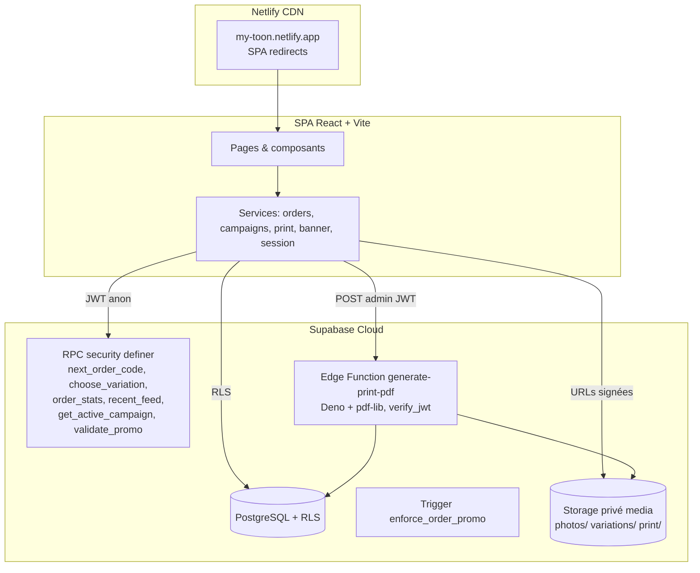
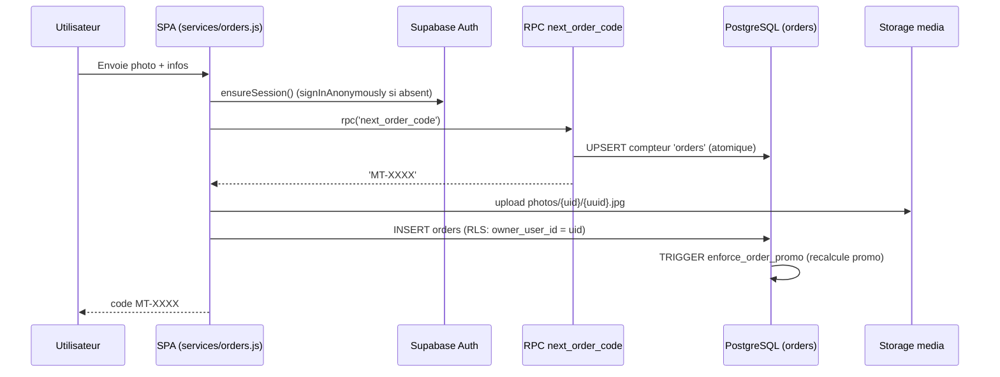

# 🏗️ Architecture — MyToon

> Public : **développeurs, intégrateurs, mainteneurs**.
> Vue d'ensemble : [`README.md`](../../README.md) · Portail : [`docs/README.md`](../README.md)

Ce document décrit l'architecture technique du projet MyToon : topologie, flux de données, schéma de base de données, storage, authentification et routing.

## Sommaire

1. [Vue d'ensemble](#1-vue-densemble)
2. [Topologie (développement vs production)](#2-topologie)
3. [Flux de données](#3-flux-de-données)
4. [Schéma de base de données](#4-schéma-de-base-de-données)
5. [Authentification](#5-authentification)
6. [Storage (bucket `media`)](#6-storage)
7. [Edge Function `generate-print-pdf`](#7-edge-function)
8. [Routing & réseau](#8-routing--réseau)
9. [Historique des migrations](#9-historique-des-migrations)

---

## 1. Vue d'ensemble



**Principes structurants**

1. **Le client ne parle jamais directement aux tables sensibles.** Les opérations critiques passent par des **RPC `security definer`** (codes, validation, stats, campagnes) ou par l'**Edge Function** (PDF).
2. **RLS partout** : chaque table est protégée par Row Level Security. Un client ne voit que ses commandes.
3. **Aucun secret côté client** : seules des clés *publishable* sont embarquées dans le bundle ; les secrets (service key) ne vivent que dans les scripts backend et les variables Netlify/Supabase.
4. **Le serveur est autoritaire** : les prix promos sont recalculés par le trigger `enforce_order_promo`, jamais la valeur transmise par le client.

---

## 2. Topologie

### Développement local

```
Navigateur (http://localhost:5173)
        │  Vite dev server
        ▼
┌───────────────────────┐       ┌───────────────────────────────┐
│  SPA React + Vite     │──────▶│  Supabase Cloud (distant)     │
│  src/ lib/ services/  │       │  PostgreSQL + Storage + Edge  │
└───────────────────────┘       └───────────────────────────────┘
```

- **Vite** sert l'application (`npm run dev`, port 5173).
- Le client Supabase (`src/lib/supabase.js`) pointe vers le projet **Supabase distant** (via `VITE_SUPABASE_URL` / `VITE_SUPABASE_PUBLISHABLE_KEY`).
- La CLI Supabase (`npx supabase`) est utilisée pour les **migrations** et le **déploiement des Edge Functions** — pas pour un backend local dans le workflow actuel.

### Production

```
Utilisateur
    │
    ▼
Netlify CDN (my-toon.netlify.app)
    │  statiques (dist/), SPA fallback via public/_redirects
    ▼
SPA React (bundle)
    │
    ├──────▶ Supabase : REST / GraphQL / RPC  (JWT anon ou admin)
    ├──────▶ Supabase Storage : URLs signées
    └──────▶ Supabase Edge Function : POST /functions/v1/generate-print-pdf
```

---

## 3. Flux de données

### 3.1 Création d'une commande (client)



- La compression image (`compressImageToBlob`, max 1200 px, qualité 0.82) a lieu côté client avant upload.
- Le téléphone est normalisé en **E.164** par `src/utils/phone.js`.

### 3.2 Validation d'une déclinaison (client)

```
Client → rpc('choose_variation', { order_code, variation_index })
          └─ security definer : vérifie
             1. la commande existe
             2. owner_user_id = auth.uid()
             3. status = 'propositions_pretes'
             4. index valide
             └─ UPDATE : chosen_variation + status='validee' + timeline
```

Le client ne peut **pas** mettre à jour `orders` directement (pas de policy d'UPDATE pour lui).

### 3.3 Génération du PDF imprimeur (admin)

```
Admin (JWT) → POST /functions/v1/generate-print-pdf { code }
              ├─ verify_jwt = true (config.toml)
              ├─ getUser() → vérifie présence dans table admins
              ├─ charge la commande, exige une déclinaison validée
              ├─ URL signée (3600 s) sur la déclinaison choisie
              ├─ construit le PDF A4 (pdf-lib, artwork centré)
              ├─ upload media/print/{code}.pdf (upsert)
              └─ UPDATE orders.print_pdf_path + updated_at
```

Détail complet : [`API.md`](API.md).

---

## 4. Schéma de base de données

### 4.1 Table `orders`

| Colonne | Type | Rôle |
| --- | --- | --- |
| `id` | uuid PK | `gen_random_uuid()` |
| `code` | text UNIQUE | Code client `MT-XXXX` |
| `owner_user_id` | uuid FK → auth.users | Propriétaire (session anon) |
| `owner_phone` | text | Téléphone normalisé E.164 (backfill migration 0009) |
| `client` | jsonb | `{ nom, telephone, quartier, adresse, … }` |
| `product` | jsonb | `{ id, name, type, price, … }` |
| `avatar` | jsonb | `{ id, style, image, name }` (style choisi) |
| `options` | jsonb | `{ size, color }` |
| `photo_path` | text | Chemin storage de la photo du client |
| `status` | text | Un des 7 statuts |
| `timeline` | jsonb | Historique `[{ status, date, note }]` |
| `variations` | jsonb | Chemins storage des 3 déclinaisons |
| `chosen_variation` | text | Déclinaison validée par le client |
| `printer_id` | text | Identifiant imprimeur assigné |
| `promo` | jsonb | `{ code, discount }` — recalculé par trigger |
| `print_pdf_path` | text | Chemin `print/{code}.pdf` |
| `created_at` / `updated_at` | timestamptz | Horodatage |

Index : `code`, `owner_user_id`, `status`.

### 4.2 Table `admins`

| Colonne | Type | Rôle |
| --- | --- | --- |
| `id` | uuid PK → auth.users | Lié au compte Auth |
| `email` | text | Email admin |
| `created_at` | timestamptz | Date d'ajout |

### 4.3 Table `settings`

| Colonne | Type | Rôle |
| --- | --- | --- |
| `key` | text PK | Ex. `promo` |
| `value` | jsonb | `{ text, active }` pour le bandeau |

### 4.4 Table `campaigns`

| Colonne | Type | Rôle |
| --- | --- | --- |
| `id` | uuid PK | |
| `code` | text UNIQUE | Identifiant interne |
| `name` | text | Nom (Halloween, Noël…) |
| `start_date` / `end_date` | timestamptz | Fenêtre (end optionnel = illimitée) |
| `active` | boolean | Interrupteur manuel |
| `banner_text` | text | Bandeau affiché |
| `accent_color` | text | Couleur d'accent (défaut `#ff6b35`) |
| `promo_code` | text | Code promo (optionnel) |
| `promo_discount` | int | Remise en % (optionnel) |
| `created_at` | timestamptz | |

### 4.5 Table `counters`

| Colonne | Type | Rôle |
| --- | --- | --- |
| `key` | text PK | `'orders'` |
| `value` | bigint | Compteur atomique |

---

## 5. Authentification

### Sessions anonymes (clients)

- À la première interaction, `ensureSession()` crée une session **anonyme** (`auth.signInAnonymously()`).
- La session est liée à l'**appareil** (stockée dans le navigateur). Les commandes sont rattachées à `owner_user_id`.
- Un client « perd » l'accès à ses commandes s'il change d'appareil tant que la connexion SMS n'est pas livrée (Phase B, voir [`ROADMAP.md`](../product/ROADMAP.md)).
- **Prérequis Supabase** : Auth → Providers → **Anonymous** activé.

### Connexion admin

- Email + mot de passe (`auth.signInWithPassword`).
- Le rôle admin est vérifié par présence dans la table `admins` (via la fonction `is_admin()`).
- Création du compte : `scripts/seed-admin.mjs` (clé service requise).

---

## 6. Storage

Bucket **privé** `media` (`storage.buckets.public = false`).

| Chemin | Qui écrit | Qui lit |
| --- | --- | --- |
| `photos/{uid}/{uuid}.{ext}` | Client (sa photo) | Propriétaire via URL signée |
| `variations/{code}/{1..3}.{ext}` | Admin | Client propriétaire de la commande via URL signée |
| `print/{code}.pdf` | Edge Function (admin) | Admin via URL signée 7 jours |

- Le navigateur ne reçoit **jamais** de fichier directement : uniquement des **URLs signées** (`createSignedUrl`).
- Policies storage détaillées : [`SECURITY.md`](SECURITY.md).

---

## 7. Edge Function

- Nom : `generate-print-pdf`
- Runtime : Deno (Supabase Edge Functions)
- Dépendances : `jsr:@supabase/supabase-js@2`, `pdf-lib` (esm.sh)
- Configuration : `verify_jwt = true` dans `supabase/config.toml`
- CORS : `_shared/cors.ts` (`*`, méthodes GET/POST/OPTIONS)

Cycle de vie : requête POST → JWT admin → commande + déclinaison → PDF A4 (artwork au ratio conservé, bandeau méta) → upload `print/{code}.pdf` → mise à jour `orders.print_pdf_path`.

---

## 8. Routing & réseau

### SPA

- `react-router-dom@7` gère les routes : `/`, `/commande`, `/suivi`, `/espace/commandes`, `/espace/commandes/:code`, `/admin`, `/legal/*`.
- `public/_redirects` (`/* /index.html 200`) assure le fallback SPA sur Netlify.

### Réseau

- Tous les appels partent du navigateur vers Supabase (HTTPS).
- Pas de serveur applicatif custom : Netlify ne sert que des statiques.
- Déploiement : push `master` → build Netlify automatique.

---

## 9. Historique des migrations

| Migration | Contenu |
| --- | --- |
| `0001_init.sql` | Tables `orders`, `admins`, `settings` ; RLS ; Storage `media` ; RPC `choose_variation` |
| `0002_order_code_rpc.sql` | Table `counters` + RPC `next_order_code()` (`MT-0001`…) |
| `0003_fix_admin_policy.sql` | Fonction `is_admin()` — corrige la récursion RLS sur `admins` |
| `0004_public_stats.sql` | RPC `order_stats()` (compteurs publics) |
| `0005_recent_feed.sql` | RPC `recent_feed()` (ticker social anonymisé) |
| `0006_campaigns.sql` | Table `campaigns`, `get_active_campaign()`, `validate_promo()`, seed 3 campagnes |
| `0007_orders_promo.sql` | Colonne `orders.promo` |
| `0008_print_pdf.sql` | Colonne `orders.print_pdf_path` |
| `0009_remediation.sql` | 7 statuts (retrait `validation_attente`), backfill E.164, trigger `enforce_order_promo` |

> ⚠️ Ne modifie jamais une migration déjà appliquée en production : ajoute une nouvelle migration numérotée `0010_…`.

---

## Références croisées

- [API.md](API.md) — signatures RPC, schéma, exemples
- [SECURITY.md](SECURITY.md) — RLS, JWT, storage, modèle de menaces
- [DECISIONS.md](DECISIONS.md) — arbitrages (DEC-004 Supabase, DEC-005 React+Vite, DEC-006 sessions anonymes, DEC-010 PDF DTF)
- [API.md → workflow PDF](API.md)
