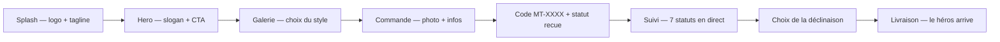

# 🚀 Produit — MyToon

> Public : **équipe produit, marketing, communication, partenaires, investisseurs**.
> Ce document est la référence identitaire et produit de MyToon : vision, positionnement, valeurs, promesses, parcours client et ton éditorial.
> Portail : [`docs/README.md`](../README.md)

## Sommaire

1. [Vision & mission](#1-vision--mission)
2. [Pourquoi Abidjan](#2-pourquoi-abidjan)
3. [Pourquoi le streetwear](#3-pourquoi-le-streetwear)
4. [Pourquoi des artistes humains (pas d'IA)](#4-pourquoi-des-artistes-humains-pas-dia)
5. [Slogans & expressions de marque](#5-slogans--expressions-de-marque)
6. [Les 4 valeurs](#6-les-4-valeurs)
7. [La promesse client](#7-la-promesse-client)
8. [Le parcours émotionnel](#8-le-parcours-émotionnel)
9. [Offre & prix](#9-offre--prix)
10. [Ton éditorial & charte rédactionnelle](#10-ton-éditorial--charte-rédactionnelle)
11. [Positionnement](#11-positionnement)
12. [Éthique & confidentialité](#12-éthique--confidentialité)

---

## 1. Vision & mission

> **Né à Abidjan, taillé pour les héros.**

**Vision** : faire de la personnalisation d'exception une expérience simple, rapide et accessible — pour l'Afrique d'abord, ouverte au monde.

**Mission** : chaque personne mérite son propre héros. MyToon transforme une simple photo en une œuvre portée : un t-shirt ou un polo 100 % coton local, illustré par un artiste humain, livré à Abidjan en 24-48 h.

**Le problème résolu** : se faire personnaliser un vêtement est long, opaque et réservé à une poignée d'artisans. Le client ne voit rien, ne choisit rien, et attend des semaines sans savoir où en est sa commande. MyToon inverse tout ça : visibilité totale, choix réel, 1 h de création, suivi en temps réel.

---

## 2. Pourquoi Abidjan

- **Origine** : la marque est **née à Abidjan** — c'est son ancrage et son ADN (section « Pourquoi ce projet existe » du [`README.md`](../../README.md)).
- **Une culture vivante** : le streetwear abidjanais est un langage d'appartenance, de fierté et de créativité. MyToon s'appuie dessus plutôt que de l'importer.
- **Un modèle pensé pour l'Afrique** : paiement **à la livraison** (Wave, Orange Money, MTN MoMo, espèces) — adapté aux usages locaux —, coton local, livraison 24-48 h à Abidjan.
- **Ouverture au monde** : la marque est pensée pour l'Afrique **et** ouverte au monde — l'export est un horizon (voir [`ROADMAP.md`](ROADMAP.md)).

---

## 3. Pourquoi le streetwear

- Le vêtement est le support parfait de la **métaphore du héros** : quelque chose qu'on **porte** pour dire qui on est.
- Le streetwear valorise **l'expression individuelle** et la **fierté d'appartenance** — exactement les valeurs MyToon.
- Le t-shirt (10 000 FCFA) et le polo (15 000 FCFA) sont des supports **accessibles** et portables au quotidien, imprimables en haute qualité (DTF).
- Le style s'inspire des **héros de la culture pop** (Manga, Comics, Pop Art) — un vocabulaire universel qui parle aussi bien à Abidjan qu'ailleurs.

---

## 4. Pourquoi des artistes humains (pas d'IA)

> **Décision produit fondatrice — voir [`DECISIONS.md`](../developers/DECISIONS.md), DEC-001.**

- MyToon n'utilise **pas** de transformation automatique par IA : chaque toon est **dessiné à la main par un artiste** à partir de la photo du client.
- C'est la **différence qualitative** du produit : un rendu vivant, expressif, qui ne ressemble pas à un filtre.
- Conséquences assumées :
  - la création prend **1 heure** (pas instantanée) ;
  - le client reçoit **3 déclinaisons** à choisir (co-création) ;
  - le coût de création est **inclus** dans le prix du vêtement ;
  - chaque style (Manga, Comics, Pop Art) a une identité artistique propre, documentée dans `src/utils/constants.js`.

> ⚠️ Le positionnement « artiste humain » doit rester cohérent dans **toute** la communication (site, support, réseaux) : ne jamais promettre une génération automatique ou instantanée.

---

## 5. Slogans & expressions de marque

| Expression | Usage |
| --- | --- |
| **« Envoie une photo, reçois un héros à porter. »** | Slogan principal (hero, README) |
| **« Né à Abidjan, taillé pour les héros. »** | Signature de marque (pied de page, README) |
| **« ABIDJAN STREET WEAR »** | Sous-marque streetwear (badge/hero) |
| **« Activer mon pouvoir »** | CTA principal du hero |
| **« Plus qu'un vêtement, une déclaration. »** | Sous-titre des valeurs |

> ⚠️ Seuls les slogans présents dans le produit sont listés ici. Toute nouvelle expression doit être validée avant usage (voir [`docs/README.md`](../README.md), Documentation Policy).

---

## 6. Les 4 valeurs

Déclarées dans le produit (`src/components/features/Features.jsx` — section « Les valeurs MyToon ») :

| Valeur | Icône | Signification |
| --- | --- | --- |
| **Individualité** | 🦸 | Chaque personne mérite son propre héros. Pas de modèle, que du sur-mesure. |
| **1 heure chrono** | ⚡ | Nos artistes préparent 3 déclinaisons en une heure. Tu choisis. |
| **Fierté** | 🔥 | Porter MyToon, c'est afficher qui tu es vraiment. Ton histoire, ton pouvoir. |
| **Culture** | 🌍 | Une marque née à Abidjan. Pensée pour l'Afrique. Ouverte au monde. |

---

## 7. La promesse client

1. **3 déclinaisons en 1 heure** : tu reçois 3 propositions artistiques de ton toon, tu choisis.
2. **Qualité artisanale** : chaque toon est dessiné à la main par un artiste, pas un filtre.
3. **Suivi en temps réel** : un simple code `MT-XXXX` te montre les 7 statuts.
4. **Livraison 24-48 h** à Abidjan, paiement **à la livraison**.
5. **Fichier d'impression professionnel** : PDF A4 / DTF transmis à l'imprimeur partenaire.

> **La contre-promesse** (honnêteté produit) : la création n'est **pas instantanée** (1 h), elle est réservée à **Abidjan** (24-48 h), et le client **doit valider** avant impression. Ne jamais promettre au-delà.

---

## 8. Le parcours émotionnel

| Étape | Émotion ciblée |
| --- | --- |
| **Splash** (1,9 s, une fois par session) | Émerveillement, anticipation |
| **Hero + CTA « Activer mon pouvoir »** | Désir, appel à l'action |
| **Galerie des styles** | Identification, envie de création |
| **Commande** | Confiance, simplicité |
| **Réception du code** | Réassurance (quelque chose a commencé) |
| **Suivi en temps réel** | Transparence, impatience positive |
| **Choix de la déclinaison** | Co-création, fierté de choisir |
| **Livraison** | Accomplissement, envie de recommander |

---

## 9. Offre & prix

| Produit | Prix | Détail |
| --- | --- | --- |
| **T-shirt coton local** | 10 000 FCFA | Coton 100 % local, coupe classique, toon imprimé devant — tailles S→XXL, couleurs Blanc/Noir |
| **Polo coton local** | 15 000 FCFA | Coton local, col polo, toon brodé sur la poitrine — tailles S→XL, couleurs Blanc/Noir |

- La **création du toon est incluse** dans le prix.
- Livraison **gratuite** à Abidjan.
- Paiement **à la livraison**.
- Guide des tailles (`src/utils/constants.js`) : S (88-96 cm) → XXL (120-128 cm).

### Styles
3 styles **actifs** : **Manga** 📖, **Comics** 💥, **Pop Art** 🎭. Styles **« Bientôt »** : **Cartoon** 🎨, **Sketch** ✏️ (badge déjà en place).

---

## 10. Ton éditorial & charte rédactionnelle

### Principes
- **Tutoiement** : le produit s'adresse directement au client (« Tu envoies une photo… »). Cohérent partout (site, centre d'aide, tutoriels).
- **Conversationnel et chaleureux**, jamais corporate : phrases courtes, actions claires.
- **Encadrés de lisibilité** : 💡 (astuce) et ⚠️ (attention) dans la documentation utilisateur.
- **Vocabulaire du héros** : « toon », « déclinaisons », « héros », « pouvoir », « atelier » — un univers cohérent.

### Règles
1. **Ne jamais inventer** de promesse hors produit (délais, prix, fonctionnalités).
2. **Toujours préciser le prix en FCFA** avec espace : `10 000 FCFA`.
3. **Le code de commande s'écrit `MT-XXXX`** en majuscules.
4. **Féminiser/masculiniser avec soin** : tutoiement neutre ou inclusif selon contexte.
5. **Signer les contenus longs** avec la signature « Né à Abidjan, taillé pour les héros. » 🔥

---

## 11. Positionnement

| Axe | MyToon |
| --- | --- |
| **Catégorie** | Streetwear personnalisé « toon » |
| **Public cible** | Jeunes urbains d'Abidjan et au-delà, amateurs de culture pop (Manga/Comics) |
| **Différenciateur** | Artiste **humain** + **3 déclinaisons en 1 h** + **suivi transparent** + paiement à la livraison |
| **Anti-positionnement** | Pas une usine à filtres IA, pas une marketplace impersonnelle, pas un luxe inaccessible |
| **Géographie** | Abidjan (livraison 24-48 h) — horizon : ouverture **À compléter** |

---

## 12. Éthique & confidentialité

- Les photos envoyées servent **uniquement** à créer le toon ; elles ne sont **jamais revendues** (CGV) ni exposées publiquement.
- La preuve sociale publique est **anonymisée** : prénom + quartier + style + statut uniquement (`recent_feed`).
- Données conservées le temps nécessaire, suppression à la demande (Politique de Confidentialité — [`LegalPages.jsx`](../../src/pages/LegalPages.jsx)).
- Règles détaillées dans [`SECURITY.md`](../developers/SECURITY.md).

---

## Références croisées

- [ROADMAP.md](ROADMAP.md) — horizon produit
- [CHANGELOG.md](CHANGELOG.md) — historique des évolutions
- [DECISIONS.md](../developers/DECISIONS.md) — arbitrages produit (DEC-001 à DEC-003)
- [CENTRE-AIDE.md](../users/CENTRE-AIDE.md) — promesses traduites pour le client
- [DESIGN-SYSTEM.md](../developers/DESIGN-SYSTEM.md) — direction artistique
